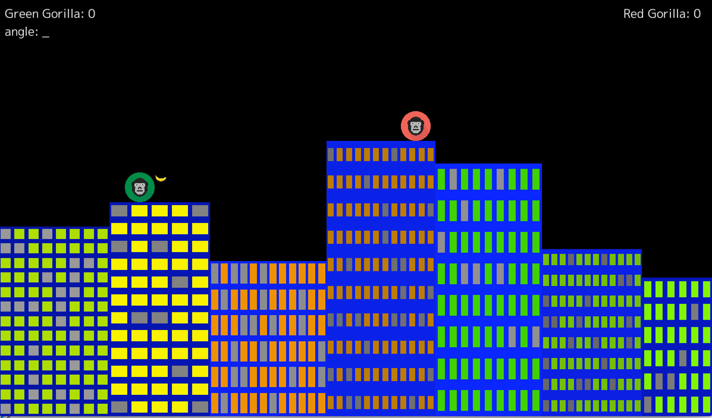

# gogorilla
The classic Gorilla game in Go, built with the [ebiten game engine](https://ebiten.org/).



## Installation

### Dependencies

Dependencies are handled by [go modules](https://blog.golang.org/using-go-modules). 

### Build

```$ go build main.go```

### Run

```$ ./main```
